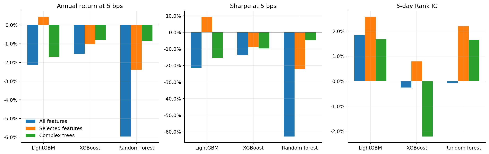
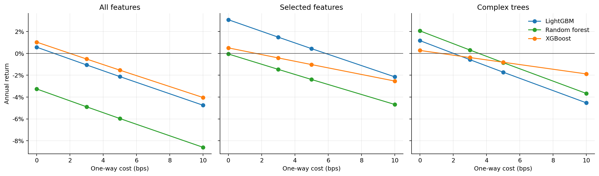
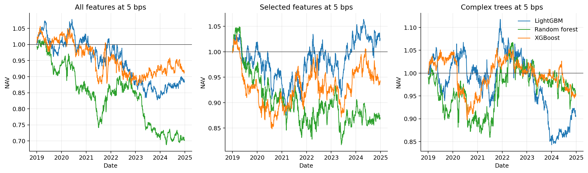
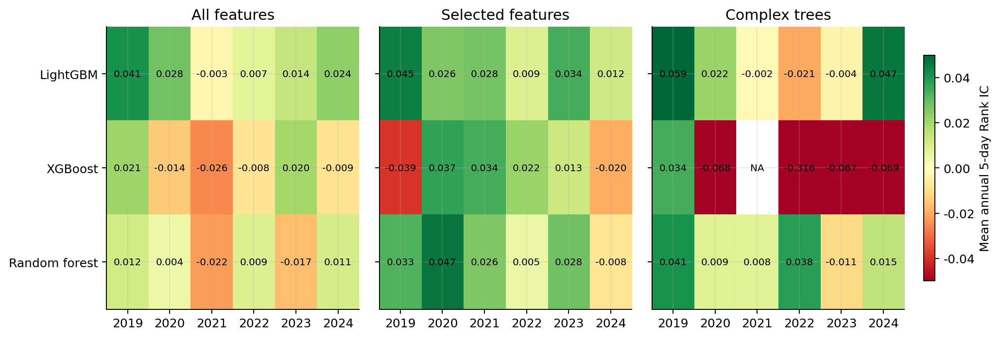
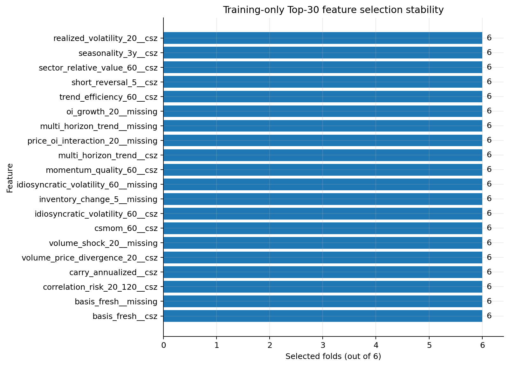

# ML-Commodity-Factor-China
Applying machine learning to multi-factor investing and return prediction in Chinese commodity futures.

## Rolling OOS experiment figures

The `experiments/` directory contains reproducible regularized tree-model, feature-selection, and complex-tree extensions. Figures below use aggregate OOS outputs only; no market data, feature panel, labels, or model checkpoints are included in this repository.

### Model comparison at 5 bps

### Cost sensitivity

### Net asset value at 5 bps

### Annual Rank IC

### Feature selection stability

