# Heterogeneous Continual GNN 日频期货模型提交报告

## 0. 提交流程与差异声明

本实验采用 GNN 专用修订协议：TuShare 主力连续映射、2015 起点扩展窗口、样本截止 2023、图结构及 CPD/GAP/MA 辅助任务、二阶拉普拉斯多项式谱滤波。主成本为单边 5 bps，并报告 0/3/5/10 bps 敏感性。

## 1. 数据与模型

- 训练/验证：2015 起点扩展窗口，OOS 为 2019—2023。
- 输入：47 个可用概念因子展开为 92 维（数值列与缺失标记）。
- 模型参数：hidden_dim=64，num_blocks=2，dropout=0.1，batch_size=64。
- 执行：截面前后 20% 多空、组内等权、五个等权持有队列、五日持有、净敞口 0。

## 2. 样本外结果（5 bps）

| variant         |   annual_return |   annual_volatility |   sharpe |   max_drawdown |   win_rate |   daily_turnover |   terminal_nav |   rank_ic_5d |
|:----------------|----------------:|--------------------:|---------:|---------------:|-----------:|-----------------:|---------------:|-------------:|
| hcgnn_continual |       0.0311024 |           0.0733349 | 0.454337 |      -0.134423 |   0.51318  |        0.0722762 |        1.15899 |    0.0192908 |
| protocol_gnn    |       0.0273083 |           0.071472  | 0.412671 |      -0.157497 |   0.526359 |        0.0920566 |        1.13859 |    0.0225946 |

## 3. 本次结果解读

本次样本外回测中，hcgnn_continual 的年化收益更高。HCGNN 持续学习版为 3.11%，协议 GNN 为 2.73%。
风险调整后，hcgnn_continual 的夏普更高。持续学习版为 0.454，协议 GNN 为 0.413。
回撤方面，hcgnn_continual 较浅。持续学习版最大回撤为 -13.44%，协议 GNN 为 -15.75%。
换手率分别为 7.23% 和 9.21%。若把交易成本进一步抬高，换手较低的持续学习版通常更有优势。
不过五日 Rank IC 由 protocol_gnn 领先，持续学习版为 0.0193，协议 GNN 为 0.0226。这说明持续学习版的组合收益更好，但单日截面排序优势并不更强，结论应结合图 1、图 2、图 5 和成本敏感性表一起看。

## 4. 图表索引

所有图片均作为独立文件放在 `figures/` 下；以下链接使用相对路径，因此提交 Markdown 时必须连同整个 `figures/` 文件夹一起发送。

### 图 01：样本外净值与回撤

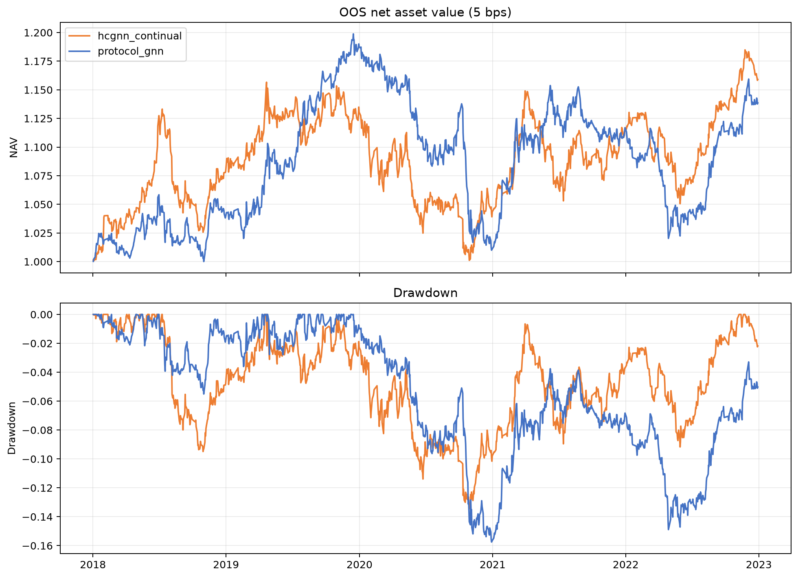

图意说明：上图是扣除单边 5 bps 后的累计净值，下图是净值距离历史高点的跌幅。净值长期向上、回撤较浅且修复较快更理想。两条线使用相同交易日期，可以直接比较两个模型。

### 图 02：扩展窗口各折 Rank IC

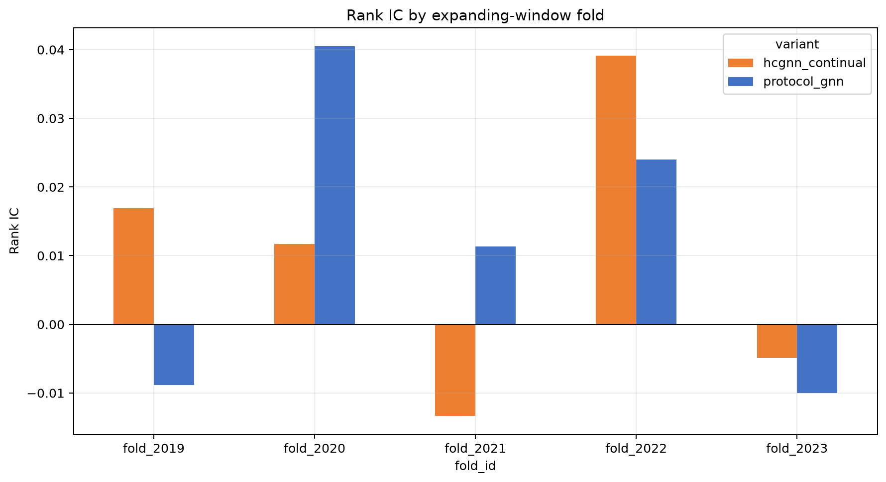

图意说明：每根柱对应一个样本外年份。Rank IC 衡量预测排序与未来五日收益排序是否一致，大于 0 表示方向正确。比起某一年特别高，更应关注多数年份是否稳定为正。

### 图 03：60 日滚动 Rank IC

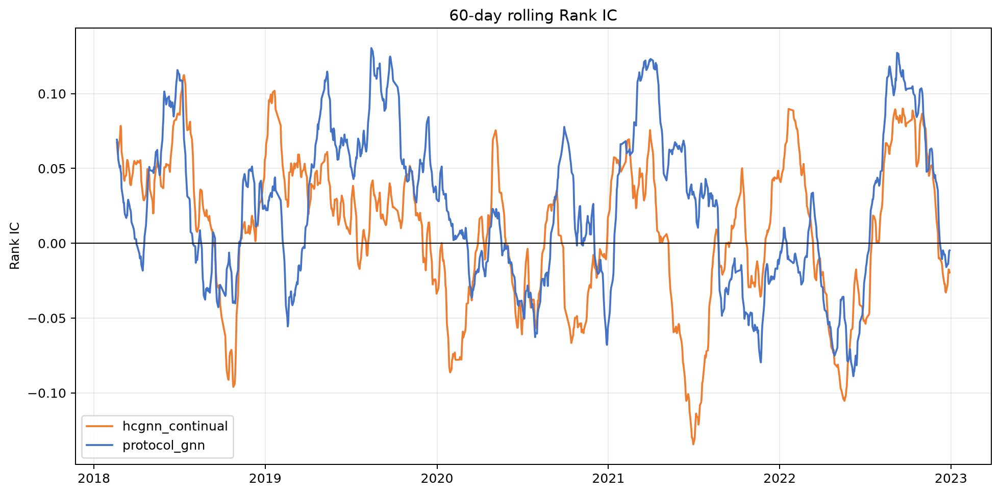

图意说明：曲线是最近 60 个交易日的平均 Rank IC，用来观察模型是否随市场状态失效。曲线持续在 0 上方说明近期排序有效，跌到 0 以下则表示这一阶段的信号方向可能反了。

### 图 04：日频 Rank IC 分布

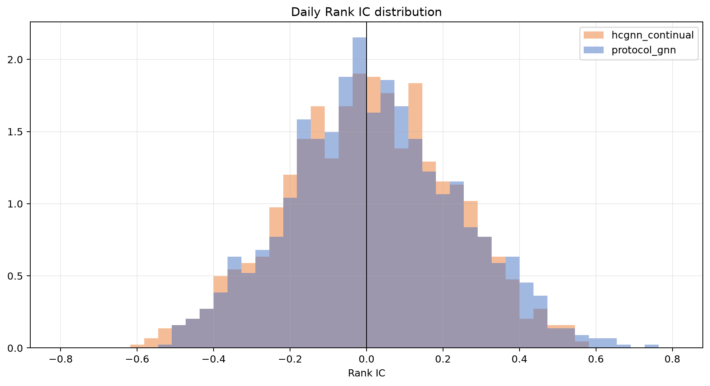

图意说明：横轴是每天的 Rank IC，纵轴是出现频率。分布中心越靠右越好；左侧长尾说明模型偶尔会出现较大的反向预测。它能补充均值指标，避免少数极端日期掩盖日常表现。

### 图 05：预测五分组单调性

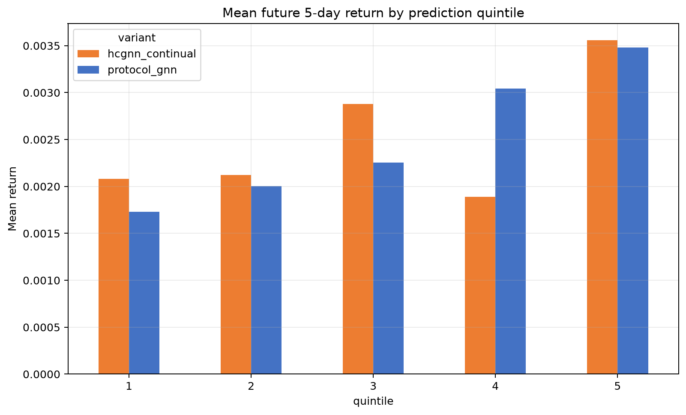

图意说明：每天按预测值从低到高分成五组，Q1 是预测最低组，Q5 是预测最高组。柱子从 Q1 到 Q5 逐步升高，且 Q5 与 Q1 差距明显，才说明模型适合用来做截面多空排序。

### 图 06：年度收益率

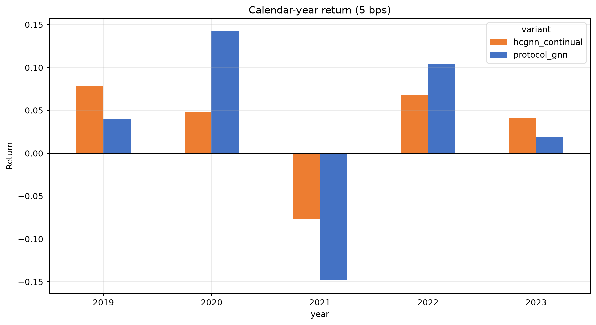

图意说明：柱子给出扣除单边 5 bps 后的年度收益。它用于检查总收益是否依赖某一个年份。如果多数年份为正，结果通常比只靠单年大涨更可信。

### 图 07：20 日平均换手率

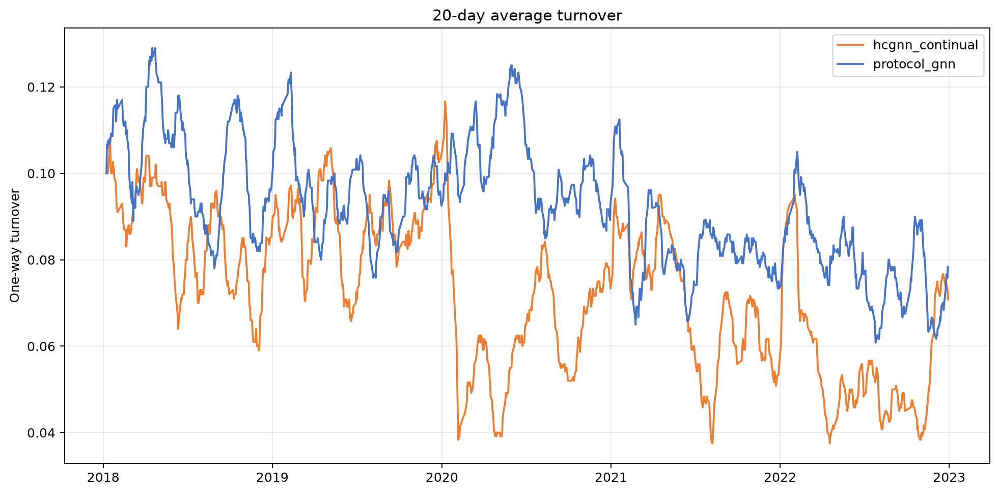

图意说明：曲线是单边换手率的 20 日均值。换手越高，手续费和滑点的影响越大。若收益改善伴随换手大幅上升，需要结合成本敏感性表判断是否值得。

### 图 08：预测值与未来收益校准

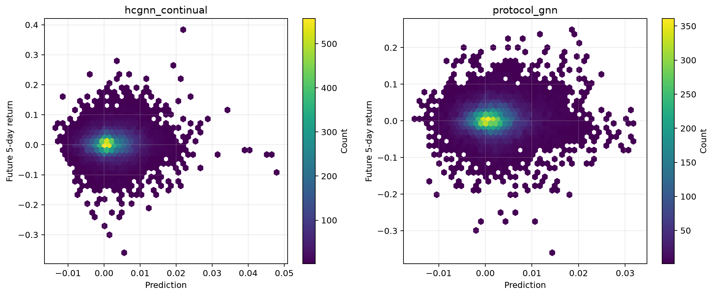

图意说明：横轴是模型预测，纵轴是实际未来五日收益，颜色越亮表示样本越密集。点云整体向右上倾斜说明预测方向有效；若点云近似水平，模型给出的数值大小与实际收益关系较弱。

### 图 09：训练集与验证集损失曲线

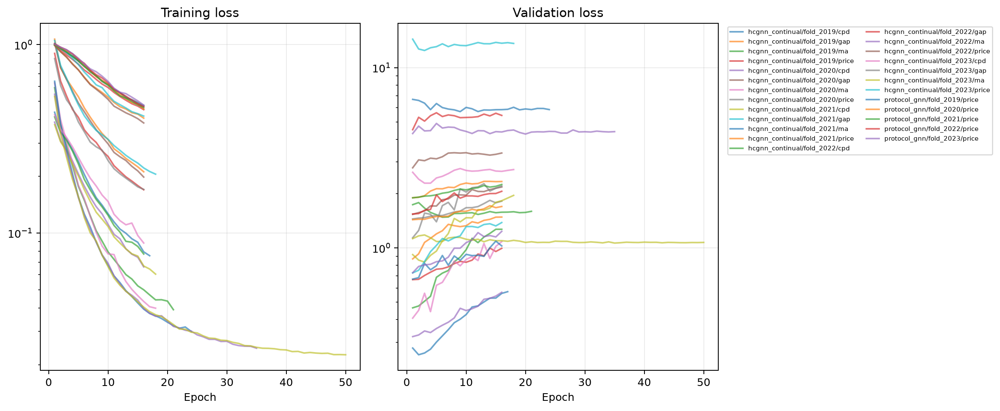

图意说明：左图是训练损失，右图是验证损失，纵轴使用对数刻度。训练损失下降而验证损失持续上升是过拟合信号。早停应保留验证损失最低附近的模型，而不是最后一个 epoch。

### 图 10：板块 Rank IC

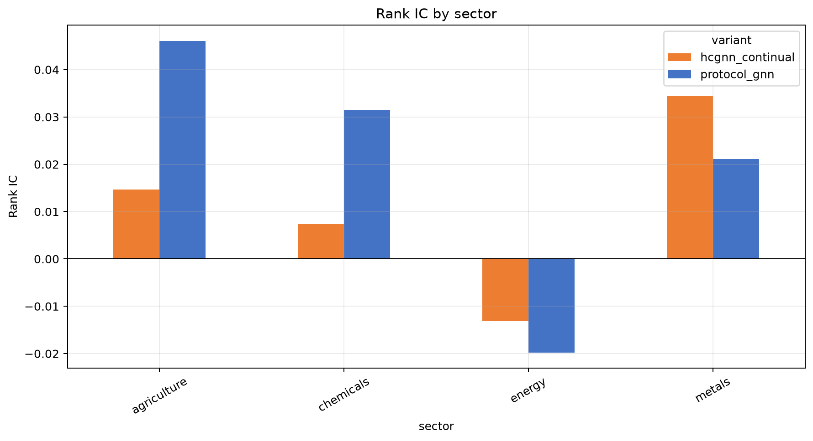

图意说明：柱子比较农业、金属、能源等板块内的 Rank IC。它能看出收益是否集中在少数板块。某个板块明显为负时，应检查该板块的数据覆盖、因子含义和图连接是否合适。

### 图 11：特征缺失率

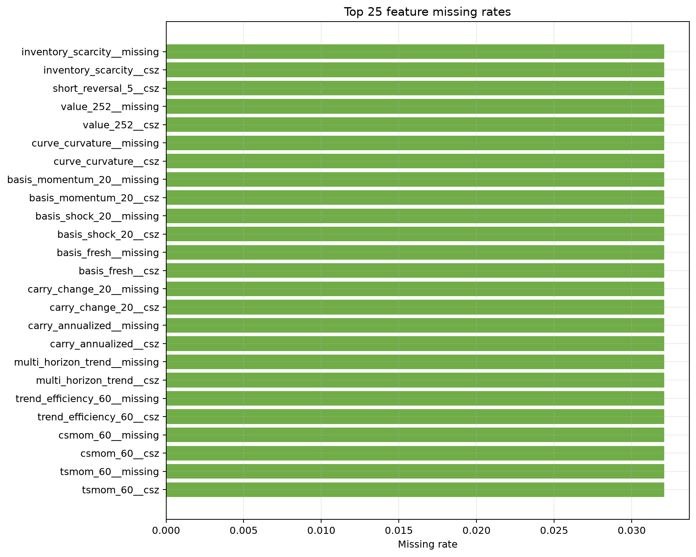

图意说明：图中列出缺失率最高的 25 个输入列。较高的缺失率不等于数据被填成 0，模型同时接收缺失标记。库存类因子覆盖较低时，应结合特征清单确认模型依赖程度。

### 图 12：各折指标热图

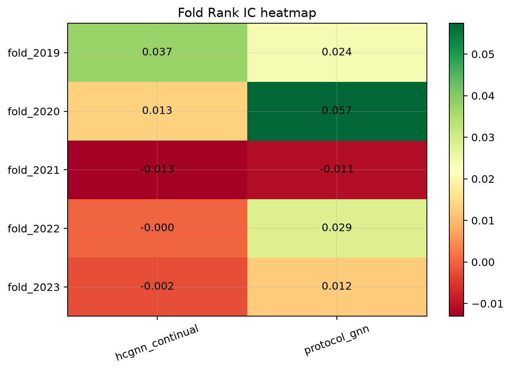

图意说明：每个格子是一个模型在一个样本外年份的 Rank IC，数字给出精确值，颜色帮助快速定位强弱年份。若结果只在一两个格子较好，其跨年份稳定性仍然不足。

## 5. 成本敏感性

下表使用相同的持仓和信号，只改变单边交易成本。年化收益、夏普和最大回撤均为样本外合并结果；日均换手不随成本假设变化。

| 模型 | 单边成本 | 年化收益 | 夏普 | 最大回撤 | 胜率 | 日均换手 |
|---|---:|---:|---:|---:|---:|---:|
| hcgnn_continual | 0 bps | 4.05% | 0.579 | -12.48% | 51.81% | 7.23% |
| hcgnn_continual | 3 bps | 3.49% | 0.504 | -12.97% | 51.40% | 7.23% |
| hcgnn_continual | 5 bps | 3.11% | 0.454 | -13.44% | 51.32% | 7.23% |
| hcgnn_continual | 10 bps | 2.18% | 0.330 | -14.61% | 50.99% | 7.23% |
| protocol_gnn | 0 bps | 3.93% | 0.575 | -14.66% | 53.13% | 9.21% |
| protocol_gnn | 3 bps | 3.21% | 0.478 | -15.32% | 52.80% | 9.21% |
| protocol_gnn | 5 bps | 2.73% | 0.413 | -15.75% | 52.64% | 9.21% |
| protocol_gnn | 10 bps | 1.55% | 0.250 | -17.10% | 51.65% | 9.21% |

持续学习版在四个成本假设下都保持较高的年化收益和夏普，且其换手率低于协议 GNN。因此成本上升时，持续学习版的相对优势会扩大。这个分支不上传 CSV 数据，完整表格保留在本地交付压缩包中。

## 6. 完整性

十折输出完整。
