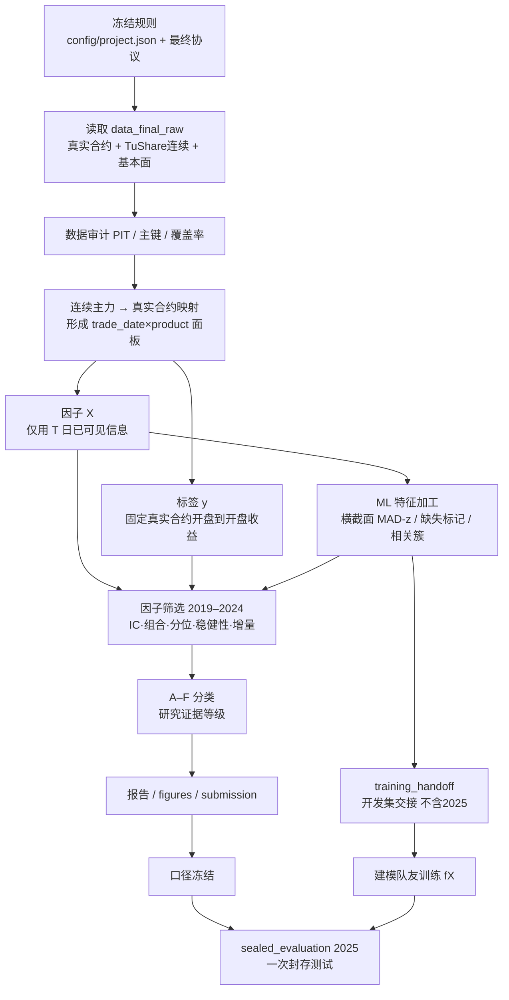

# 项目设计全流程详解

一句话定位：这是一套**协议冻结的中国商品期货因子科学筛选系统**。目标不是“找到能赚钱的公式”，而是在公平、可审计口径下，回答：

> 哪些因子有样本外预测信息？哪些只是噪声或数据不足？哪些适合交给后续机器学习？

论文问题是：**机器学习能否改善中国商品期货因子投资？**  
本仓库完成的是前置半程——**统一数据 / 执行 / 评价基座 + 57 因子筛选 + ML 交接**；真正换模型训练是队友在 `training_handoff/` 上继续做。

---

## 一、总体设计思想

系统采用“三层共享基座”架构，保证以后无论换 Ridge、树模型还是神经网络，比较都公平：

| 基座               | 冻结什么                                        | 谁不能改 |
| ------------------ | ----------------------------------------------- | -------- |
| **数据与因子基座** | 30 品种、2015–2025、特征字段、标签定义          | 模型组   |
| **执行策略基座**   | T 收盘信号 → T+1 开盘、5 日持有、前后 20%、5bps | 模型组   |
| **评价与审计基座** | IC / RankIC / Sharpe / FDR / 稳健性维度         | 模型组   |

模型只允许更换**预测器** \(f(X)\)，不能偷偷改回测口径。

本次相对原 YAML 协议有明确修订（见 `PROTOCOL_AMENDMENT.md`）：

1. **主力规则**：不用 T−1 持仓量重选；读 TuShare 连续代码 → 映射真实合约  
2. **样本切分**：扩展窗口（2015 起点不变），2019–2024 逐年 OOS；2025 封存一次  
3. **因子范围**：全库 57 个概念因子；高相关保留，只做相关簇诊断  
4. **基本面**：仅有观察日、无日内发布时间 → 统一延迟 1 个交易日

---

## 二、端到端流水线（一张图）



程序入口：`scripts/run_pipeline.py` → `src/unified_factor_system/pipeline.py`。

---

## 三、分阶段详解

### 阶段 0：冻结规则（防“看结果再改口径”）

**输入**：`config/project.json`、`最终协议/`、`中国商品期货Alpha因子库V2.1_分类版.md`  

**作用**：在读数据前写死样本区间、标签、执行、折定义、成本情景。  
**关键约束**：

- 开发期截止 `2024-12-31`；2025 不参与筛选/选特征  
- 主标签：`future_return_5d`  
- 执行：前后 20%、每 5 日调仓、0/3/5/10 bps  
- 输出目录若已存在则**拒绝覆盖**（防误重跑污染）

这一步没有收益数字，只产出“实验宪法”。

---

### 阶段 1：原始数据读取与审计

**唯一数据源**：`data_final_raw/`

| 文件                                               | 用途                            |
| -------------------------------------------------- | ------------------------------- |
| `futures_contract_daily_30varieties_2015_2025.csv` | 全部真实合约日行情 + 部分基本面 |
| `tushare_theme7/*/fut_daily_raw.csv`               | TuShare 主力连续序列            |
| 字段说明 md                                        | 字典与口径                      |

程序做：主键唯一性、价格合法性、30 品种覆盖、PIT 违规检查、疑似涨跌停锁价代理、现货陈旧度等。

**产出**：清洗后的合约表、连续表、审计字典 → 写入 `reports/data_audit_report.md`。

设计要点：**发现问题就停，不擅自填补**，保证可审计。

---

### 阶段 2：连续主力 → 真实合约映射

这是本项目最关键的“可交易性”设计。

- **连续序列**：适合算长期因子形态，但不能直接当买卖标的  
- **真实合约**（如 `RB1910`）：才是收益与执行的对象  

对每个 `trade_date × product`：

1. 取当日 TuShare 连续行情字段  
2. 在同日真实合约池中按 `pre_close/open/high/low/close/settle` 等匹配  
3. 得到 `mapped_actual_ts_code`  
4. 信号在 **T 收盘**形成，交易在 **T+1 开盘**执行  

同时独立构造期限结构曲线（不依赖主力映射），并处理换月、板块归属等。

**产出**：`outputs/intermediate/mapped_product_panel.parquet`（约 78,112 行 × 80 列）。

---

### 阶段 3：并行构造「因子 X」与「标签 y」

必须严格区分四种对象：

| 对象     | 符号              | 可知时刻       | 含义              |
| -------- | ----------------- | -------------- | ----------------- |
| 原始数据 | —                 | 历史事实       | 价格、仓单、库存… |
| 因子     | \(X_{i,T}\)       | T 收盘已知     | 当日品种分数      |
| 标签     | \(y_{i,T}^{(h)}\) | 未来走完后可知 | 标准答案收益      |
| 模型预测 | \(\hat y_{i,T}\)  | 仅用 X 推断    | 后续 ML 阶段才有  |

#### 3.1 因子（57 个概念因子）

按经济家族实现：趋势动量、期限结构/Carry、基差、库存、信息冲击、流动性、波动、产业链等。

规则：

- 只用 T 日及以前可见信息  
- 基本面观察日 → **+1 交易日** 才可用  
- 现货超过 7 自然日陈旧 → 不进基差  
- 缺数据的因子登记为 **F 类**，写明原因，不伪造成“算出来了”

**产出**：`raw_factors_57.parquet`

#### 3.2 标签（开盘到开盘远期收益）

对 T 日已映射的真实合约 \(c\)：

\[
y_{i,T}^{(h)}=\frac{\mathrm{Open}_{c,\,T+h+1}}{\mathrm{Open}_{c,\,T+1}}-1
\]

- \(h\in\{1,5,20\}\)，主标签 \(h=5\)  
- 疑似锁价进出场可排除  
- **不用连续合约收益当标签**（避免拼接伪收益）

**产出**：`labels.parquet`

设计要点：标签不是预测目标的“猜测”，而是用未来行情回算的标准答案。

---

### 阶段 4：加工成机器学习特征（92 维）

原始因子不能直接丢给模型（缺失、尺度、共线）。加工规则：

1. 品种级连续变量：同日横截面中位数/MAD 标准化，截断，缺失填横截面中性  
2. 市场级条件变量：仅用历史滚动均值/标准差  
3. 高缺失率：附加 `__missing` 指示  
4. 少量预注册交互项  
5. **禁止用标签 y 做特征选择**  
6. 相关簇只诊断、不物理删字段  

结果：约 **47 个可计算因子 → 92 个 ML 字段**（含 zscore 与 missing flag）。

**产出**：`ml_features_all_years.parquet` + `features/ml_feature_registry.csv`

---

### 阶段 5：开发期因子筛选（2019–2024）

这是“科学筛选”核心，不是最终交易系统。

#### 5.1 时间结构：扩展窗口

| Fold      | 训练          | 验证 |
| --------- | ------------- | ---- |
| fold_2019 | 2015–2018     | 2019 |
| …         | 起点固定 2015 | …    |
| fold_2024 | 2015–2023     | 2024 |

逐年样本外拼成开发期评价；**2025 不参与**。

#### 5.2 评价维度

1. **预测力**：Pearson IC、Rank IC、ICIR、命中率、HAC t/p、全库 FDR  
2. **组合**：前后 20% 多空、组内等权、5 日调仓；年化/Sharpe/回撤/换手  
3. **成本情景**：0/3/5/10 bps  
4. **单调性**：五分位收益  
5. **稳健性**：1/5/20 日、延迟 1 日、分年、分品种、分板块、参数邻域  
6. **增量性**：相对固定 Ridge 基线的 OOS ΔMSE / ΔRankIC（诊断用）

#### 5.3 A–F 分类（研究证据等级）

| 类   | 含义                 | 本轮结果 |
| ---- | -------------------- | -------- |
| A    | 核心预测（过硬门槛） | **0**    |
| B    | 辅助预测             | 8        |
| C    | 条件/状态变量        | 5        |
| D    | 风险变量             | 6        |
| E    | 证据不足             | 28       |
| F    | 数据不足             | 10       |

重要设计：**分类指导研究叙事，但不回头式删除已可计算的 ML 输入**。  
交接包仍给全量可用特征，避免“用 2024 结果挑特征再假装样本外”。

**产出**：`outputs/screening/*.csv` + 多份 `reports/*.md`

---

### 阶段 6：训练交接包（给建模队友）

`training_handoff/` 是下游唯一接口：

- `ml_dataset_development.csv.gz`：特征 + 标签（至 2024）  
- `ml_feature_registry.csv`：**唯一合法输入字段清单**  
- `fold_definitions.csv`：必须按此切分，禁止随机切分  
- `training_contract.json` / 协议快照 / SHA256  

队友只做：

\[
\hat y_{i,T}=f(X_{i,T})
\]

再把 \(\hat y\) 映射到**同一套执行协议**做回测。  
**2025 不在此包中**，防止开发期反复窥视。

---

### 阶段 7：封存 2025 评价

口径、特征集合、方向、成本情景全部冻结后，才跑一次：

- `sealed_evaluation/factor_metrics_2025.csv`  
- 组合收益、分位、特征/标签（评价专用）  

本轮关键结论之一：开发期与 2025 Rank IC **同号率约 37.5%**——说明不少信号不稳定，Carry/仓单等相对更持久。

---

### 阶段 8：提交包与可视化

- `submission/`：分段指标、会计 NAV（楼梯净值，非盯市）  
- `reports/figures/`：学术图（分类、IC–Sharpe、年际热力图、Dev vs 2025 等）  

用于汇报与论文叙事，不改变筛选结论。

---

## 四、信息流与防泄露设计

```text
T 日可见信息 ──► 因子 X_T、特征
未来价格 ──────► 标签 y_T   （回测时可知，实盘 T 日不可知）
2025 ─────────► 仅 sealed_evaluation，永不进 training_handoff
基本面观察日 ─► +1 交易日才进入信号
现货过旧 ─────► 不进基差（故 basis_fresh 在 2025 为 NA）
```

防泄露检查分布在：`tests/test_point_in_time.py`、`test_labels.py`、`test_feature_*`，以及 `verify_handoff.py`（哈希校验数据与源码）。

---

## 五、模块—职责对照

| 模块 | 文件                            | 职责                   |
| ---- | ------------------------------- | ---------------------- |
| 配置 | `config.py` / `project.json`    | 路径与冻结参数         |
| 数据 | `data.py`                       | 读数、映射、审计       |
| 标签 | `labels.py`                     | 远期开盘收益           |
| 因子 | `factors.py` / `definitions.py` | 57 因子实现与登记      |
| 特征 | `features.py`                   | 92 维 ML 加工          |
| 筛选 | `screening.py`                  | IC/组合/分类/稳健性    |
| 增量 | `incremental.py`                | Ridge 增量诊断         |
| 交接 | `handoff.py`                    | training + sealed 打包 |
| 编排 | `pipeline.py`                   | 端到端调度与清单哈希   |

---

## 六、研究结论在流程中的位置

筛选结束时，系统刻意停留在：

1. **没有 A 类**：不能宣称已找到稳定核心 Alpha  
2. **B 类集中在期限结构 / 基差 / 仓单 / 库存边际**：有经济叙事与弱组合证据  
3. **全库 FDR 未过 10%**：统计上需克制  
4. **2025 持续性有限**：状态依赖 / 衰减风险真实存在  
5. **特征整体低相关、局部高共线**：适合正则化 ML，而非 47 个独立 Alpha 相加  

因此本项目的“成功”定义是：**交付可复现的公平实验基座 + 诚实筛选证据**，而不是夏普最大的曲线。

---

## 七、你若按角色使用本仓库

| 角色       | 该看什么                            | 不该做什么                      |
| ---------- | ----------------------------------- | ------------------------------- |
| 因子研究员 | `outputs/screening/`、`reports/`    | 用 2025 回头改因子定义          |
| 建模工程师 | 只读 `training_handoff/`            | 随机切分；偷看 sealed           |
| 评价人     | `sealed_evaluation/` + 统一执行协议 | 给某模型单独放松成本/涨跌停假设 |
| 审计人     | `RUN_MANIFEST.json` + SHA256        | 覆盖已有 outputs 后无痕重跑     |

---

## 八、一句话串起全流程

> **先冻结规则 → 用真实可交易合约建面板 → 在 T 日算因子、用未来算标签 → 在 2019–2024 做科学筛选与 A–F 分级 → 把可用特征无泄露地交给模型 → 口径冻结后再开一次 2025 封存考卷。**

如果你希望下一步更细，我可以按「某一天某一品种（如 2020-06-30 的 CU）」把映射、因子、标签、组合权重算一遍数值示例。